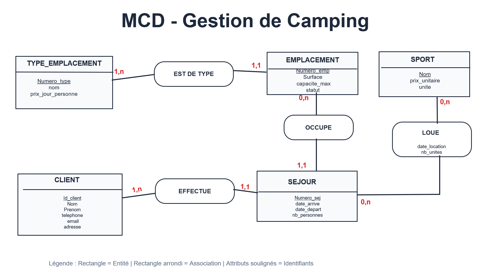
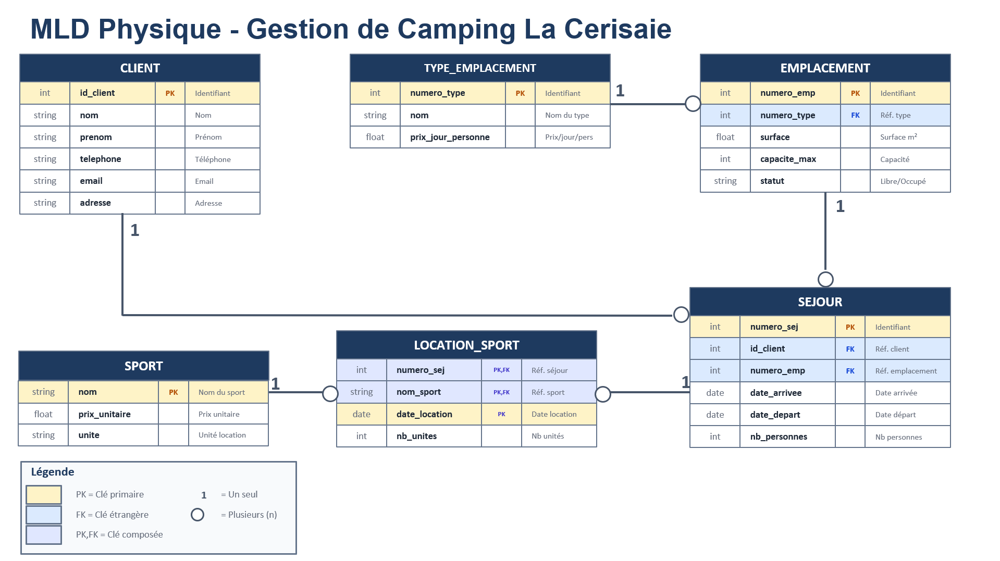

# Camping « La Cerisaie »
## Document de Modélisation

<div align="center">

| | |
|---|---|
| **Parcours** | LP-GL-S3 |
| **UE** | INF 1329 — Projet Tuteuré |
| **Encadrant** | M. AKAKPO |
| **Auteurs** | EDOH BEDI Godwin, SEWONOU Pascal |
| **Date** | 20 décembre 2025 |

</div>

---

## Table des matières

1. [Introduction](#1-introduction)
2. [Analyse des besoins](#2-analyse-des-besoins)
3. [Dictionnaire des données](#3-dictionnaire-des-données)
4. [Modèle Conceptuel de Données](#4-modèle-conceptuel-de-données-mcd)
5. [Modèle Logique de Données](#5-modèle-logique-de-données-mld)
6. [Données de référence](#6-données-de-référence)
7. [Conclusion](#7-conclusion)

---

## 1. Introduction

### 1.1 Contexte du projet

Le camping « La Cerisaie » fait face chaque année à un défi récurrent : la gestion efficace des séjours de ses campeurs. Cette problématique englobe plusieurs aspects critiques : l'attribution des emplacements, le suivi des réservations, la tarification différenciée selon les types d'hébergement, et la gestion des activités sportives proposées aux vacanciers.

Le camping propose quatre types d'hébergement (tente, caravane, camping-car et bungalow), chacun avec une tarification spécifique. De plus, des équipements sportifs (tennis, VTT, planche à voile, pédalo, canoë) sont mis à disposition des clients, générant des revenus additionnels intégrés à la facturation finale.

### 1.2 Objectifs de la solution

Notre solution digitale vise à :

- Automatiser la gestion des emplacements et leur attribution
- Enregistrer et suivre les séjours des vacanciers
- Gérer les locations d'équipements sportifs
- Générer automatiquement les factures au départ des clients
- Assurer la traçabilité et l'intégrité des données

---

## 2. Analyse des besoins

### 2.1 Besoins fonctionnels

**Gestion des emplacements**

| N° | Besoin |
|:--:|--------|
| 1 | Création et classification des emplacements par type |
| 2 | Enregistrement des caractéristiques (surface, capacité maximale) |
| 3 | Suivi du statut (libre/occupé) |

**Gestion des séjours**

| N° | Besoin |
|:--:|--------|
| 1 | Enregistrement à l'arrivée (nom responsable, date, nombre de personnes) |
| 2 | Attribution automatique ou manuelle d'un emplacement |
| 3 | Enregistrement de la date de départ et édition de la facture |

**Gestion des activités sportives**

| N° | Besoin |
|:--:|--------|
| 1 | Enregistrement des locations (sport, date, nombre d'unités) |
| 2 | Globalisation des unités par sport et par jour |
| 3 | Calcul automatique du montant dû |

### 2.2 Règles de gestion

| Code | Description |
|:----:|-------------|
| RG1 | Chaque emplacement appartient à un et un seul type d'emplacement |
| RG2 | Un type d'emplacement peut regrouper plusieurs emplacements |
| RG3 | Chaque emplacement possède une surface et une capacité maximale propres |
| RG4 | Un séjour est identifié par un numéro unique |
| RG5 | Un séjour occupe un et un seul emplacement |
| RG6 | Un emplacement peut accueillir plusieurs séjours successivement |
| RG7 | Prix du séjour = durée × prix_jour_personne × nombre_personnes |
| RG8 | Un séjour peut comporter plusieurs locations de sport ou aucune |
| RG9 | Les locations d'un même sport le même jour sont globalisées |
| RG10 | La facture comprend le coût de l'emplacement et le total des sports |

---

## 3. Dictionnaire des données

Le dictionnaire des données recense l'ensemble des informations manipulées par le système. Chaque donnée est caractérisée par son nom, son type, sa taille et une description.

### Table TYPE_EMPLACEMENT

| Attribut | Type | Taille | Description |
|----------|:----:|:------:|-------------|
| `nom_type` | Chaîne | 50 | Nom du type — Clé primaire |
| `prix_jour_personne` | Réel | — | Prix par jour et par personne (€) |

### Table EMPLACEMENT

| Attribut | Type | Taille | Description |
|----------|:----:|:------:|-------------|
| `numero_emplacement` | Entier | — | Numéro unique — Clé primaire |
| `surface` | Réel | — | Surface en m² |
| `capacite_max` | Entier | — | Nombre maximum de personnes |
| `statut` | Chaîne | 20 | Statut : libre ou occupé |

### Table SEJOUR

| Attribut | Type | Taille | Description |
|----------|:----:|:------:|-------------|
| `numero_sejour` | Entier | — | Numéro unique — Clé primaire |
| `nom_responsable` | Chaîne | 100 | Nom du responsable du groupe |
| `date_arrivee` | Date | — | Date de début du séjour |
| `date_depart` | Date | — | Date de fin du séjour |
| `nb_personnes` | Entier | — | Nombre de personnes |

### Table SPORT

| Attribut | Type | Taille | Description |
|----------|:----:|:------:|-------------|
| `nom_sport` | Chaîne | 50 | Nom du sport — Clé primaire |
| `prix_unitaire` | Réel | — | Prix par unité de location (€) |
| `unite` | Chaîne | 30 | Unité de tarification |

### Table LOCATION_SPORT

| Attribut | Type | Taille | Description |
|----------|:----:|:------:|-------------|
| `date_location` | Date | — | Date de la location |
| `nb_unites` | Entier | — | Nombre d'unités louées |

---

## 4. Modèle Conceptuel de Données (MCD)

### 4.1 Entités identifiées

| Entité | Attributs |
|--------|-----------|
| TYPE_EMPLACEMENT | nom, prix_jour_personne |
| EMPLACEMENT | numero, surface, capacite_max, statut |
| SEJOUR | numero, nom_responsable, date_arrivee, date_depart, nb_personnes |
| SPORT | nom, prix_unitaire, unite |

### 4.2 Associations et cardinalités

| Association | Entité 1 | Entité 2 | Card. 1 | Card. 2 |
|-------------|----------|----------|:-------:|:-------:|
| EST_DE_TYPE | TYPE_EMPLACEMENT | EMPLACEMENT | 1,n | 1,1 |
| OCCUPE | EMPLACEMENT | SEJOUR | 0,n | 1,1 |
| LOUE | SEJOUR | SPORT | 0,n | 0,n |

**Attributs de l'association LOUE** : date_location, nb_unites

### 4.3 Diagramme MCD



---

## 5. Modèle Logique de Données (MLD)

### 5.1 Règles de transformation appliquées

| Règle | Description |
|:-----:|-------------|
| R1 | Chaque entité devient une table |
| R2 | Association (1,1)-(1,n) : migration de la clé primaire côté (1,n) vers (1,1) |
| R3 | Association (0,n)-(0,n) avec attributs : création d'une table associative |

### 5.2 Schéma relationnel

```
TYPE_EMPLACEMENT (nom, prix_jour_personne)
    PK : nom

EMPLACEMENT (numero, surface, capacite_max, statut, #nom_type)
    PK : numero
    FK : nom_type → TYPE_EMPLACEMENT(nom)

SEJOUR (numero, nom_responsable, date_arrivee, date_depart, nb_personnes, #numero_emplacement)
    PK : numero
    FK : numero_emplacement → EMPLACEMENT(numero)

SPORT (nom, prix_unitaire, unite)
    PK : nom

LOCATION_SPORT (#numero_sejour, #nom_sport, date_location, nb_unites)
    PK : (numero_sejour, nom_sport, date_location)
    FK : numero_sejour → SEJOUR(numero)
    FK : nom_sport → SPORT(nom)
```

### 5.3 Diagramme MLD

---

## 6. Données de référence

### 6.1 Tarification des emplacements

Prix exprimés en euros, par jour et par personne.

| Type | Prix unitaire |
|------|:-------------:|
| Tente | 11,00 € |
| Caravane | 13,50 € |
| Camping-car | 14,00 € |
| Bungalow | 17,50 € |

### 6.2 Tarification des activités sportives

| Sport | Prix unitaire | Unité |
|-------|:-------------:|-------|
| Tennis | 10,00 € | heure |
| VTT | 12,00 € | demi-journée |
| Planche à voile | 16,00 € | journée |
| Pédalo | 7,00 € | 2 heures |
| Canoë | 12,00 € | demi-journée |

---

## 7. Conclusion

Ce document présente l'analyse et la conception complètes du système de gestion du camping « La Cerisaie ».

### Méthodologie appliquée

Notre approche a permis de :

- Identifier précisément les besoins fonctionnels à partir de l'énoncé
- Formaliser les règles de gestion qui gouvernent le métier
- Construire un dictionnaire des données exhaustif
- Élaborer un MCD cohérent et conforme aux exigences
- Dériver un MLD prêt pour l'implémentation

### Résultats obtenus

| Fonctionnalité | Statut |
|----------------|:------:|
| Gestion du cycle de vie des séjours | Validé |
| Suivi des emplacements disponibles | Validé |
| Enregistrement des locations sportives | Validé |
| Génération automatique des factures | Validé |

---

<div align="center">

**École Polytechnique de Lomé**

Licence Professionnelle Génie Logiciel — Semestre 3

Année académique 2025-2026

</div>